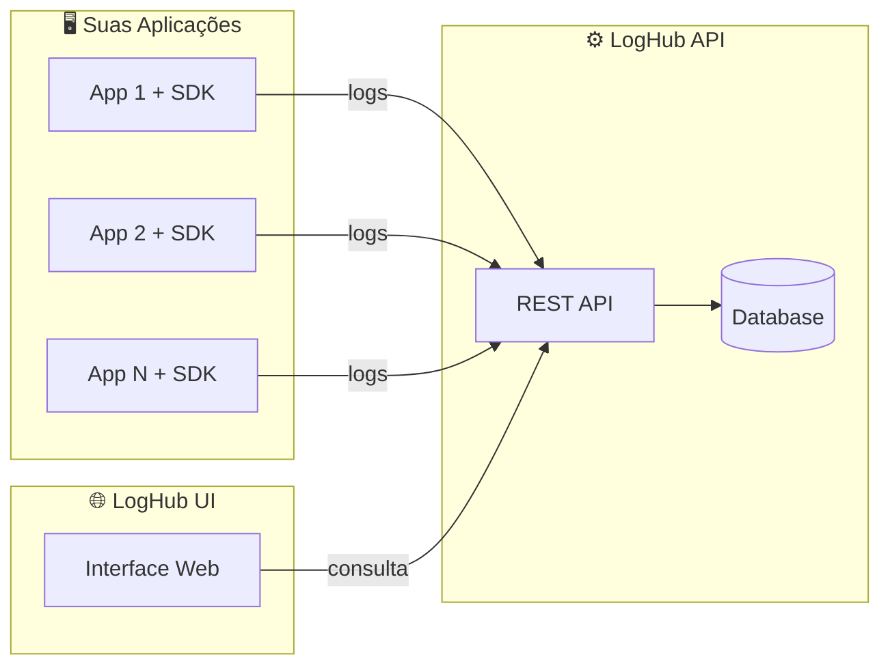

<div align="center">

# 📊 LogHub UI

**Interface web moderna para visualização e diagnóstico de logs**

[](LICENSE)
[](https://react.dev/)
[](https://www.typescriptlang.org/)
[](https://vite.dev/)
[](https://tailwindcss.com/)

[Funcionalidades](#-funcionalidades) •
[Instalação](#-instalação) •
[Configuração](#%EF%B8%8F-configuração) •
[Contribuindo](#-contribuindo) •
[Licença](#-licença)

</div>

---

## ✨ Sobre

LogHub UI é uma interface web open source para visualização, busca e diagnóstico de logs. Projetada para trabalhar com o backend [LogHub](https://github.com/loghub), oferece uma experiência intuitiva para desenvolvedores e equipes de operações monitorarem suas aplicações.

## 🚀 Funcionalidades

- 📋 **Visualização de Logs** - Tabela interativa com colunas: Timestamp, Level, Application, Environment, Message
- 🔍 **Filtros Avançados** - Filtre por aplicação, ambiente, nível e período
- 📄 **Detalhes Completos** - Modal com informações detalhadas incluindo TraceId e Metadata
- 🎨 **Indicadores Visuais** - Cores por nível de log para identificação rápida
- ⚡ **Performance** - Construído com Vite para desenvolvimento e build ultrarrápidos
- 📱 **Responsivo** - Interface adaptável para diferentes tamanhos de tela

## 🛠️ Stack Tecnológica

| Tecnologia | Versão | Descrição |
|------------|--------|-----------|
| [React](https://react.dev/) | 19 | Biblioteca para construção de interfaces |
| [TypeScript](https://www.typescriptlang.org/) | 5.9 | Superset tipado de JavaScript |
| [Vite](https://vite.dev/) | 7.2 | Build tool e dev server |
| [Tailwind CSS](https://tailwindcss.com/) | 4.1 | Framework CSS utilitário |
| [Axios](https://axios-http.com/) | 1.13 | Cliente HTTP |

## 📦 Instalação

### Pré-requisitos

- [Node.js](https://nodejs.org/) 20.19+ ou 22.12+
- [npm](https://www.npmjs.com/) ou [yarn](https://yarnpkg.com/) ou [pnpm](https://pnpm.io/)

### Passos

```bash
# Clone o repositório
git clone https://github.com/loghub/loghub-ui.git

# Entre no diretório
cd loghub-ui

# Instale as dependências
npm install

# Inicie o servidor de desenvolvimento
npm run dev
```

O aplicativo estará disponível em `http://localhost:5173`

## ⚙️ Configuração

### Variáveis de Ambiente

Copie o arquivo de exemplo e configure suas variáveis:

```bash
cp .env.example .env
```

| Variável | Descrição | Exemplo |
|----------|-----------|---------|
| `VITE_LOGHUB_API_URL` | URL base da API do LogHub | `http://localhost:8080/api` |
| `VITE_LOGHUB_API_KEY` | Chave de autenticação da API | `sua-api-key-aqui` |

### Scripts Disponíveis

```bash
npm run dev      # Inicia o servidor de desenvolvimento
npm run build    # Gera build de produção
npm run preview  # Visualiza o build de produção
npm run lint     # Executa o linter
```

## 📁 Estrutura do Projeto

```
src/
├── api/
│   └── loghubApi.ts      # Cliente Axios centralizado
├── components/
│   ├── LogTable.tsx      # Tabela de logs
│   ├── LogFilters.tsx    # Filtros de busca
│   └── LogDetails.tsx    # Modal de detalhes
├── pages/
│   └── LogsPage.tsx      # Página principal
├── types/
│   └── LogEvent.ts       # Tipos TypeScript
├── App.tsx               # Componente raiz
├── main.tsx              # Ponto de entrada
└── index.css             # Estilos globais
```

## 🔌 Integração com API

### Endpoints Utilizados

| Método | Endpoint | Descrição |
|--------|----------|-----------|
| `GET` | `/logs` | Lista logs com filtros |
| `GET` | `/logs/:id` | Detalhes de um log específico |

### Parâmetros de Filtro

| Parâmetro | Tipo | Descrição |
|-----------|------|-----------|
| `application` | string | Nome da aplicação |
| `environment` | string | Ambiente (production, staging, etc.) |
| `level` | string | Nível do log (TRACE, DEBUG, INFO, WARN, ERROR) |
| `from` | string | Data/hora inicial (ISO 8601) |
| `to` | string | Data/hora final (ISO 8601) |

## 🎨 Indicadores de Nível

| Level | Cor | Uso |
|-------|-----|-----|
| `TRACE` | Cinza | Informações detalhadas de debug |
| `DEBUG` | Cinza escuro | Informações de desenvolvimento |
| `INFO` | Azul | Eventos informativos |
| `WARN` | Amarelo | Situações de alerta |
| `ERROR` | Vermelho | Erros e exceções |

## 🤝 Contribuindo

Contribuições são muito bem-vindas! Sinta-se à vontade para abrir issues e pull requests.

### Como Contribuir

1. Faça um fork do projeto
2. Crie uma branch para sua feature (`git checkout -b feature/nova-feature`)
3. Faça commit das suas alterações (`git commit -m 'feat: adiciona nova feature'`)
4. Faça push para a branch (`git push origin feature/nova-feature`)
5. Abra um Pull Request

### Convenções de Commit

Este projeto segue o padrão [Conventional Commits](https://www.conventionalcommits.org/):

- `feat:` Nova funcionalidade
- `fix:` Correção de bug
- `docs:` Alterações na documentação
- `style:` Formatação de código
- `refactor:` Refatoração de código
- `test:` Adição ou modificação de testes
- `chore:` Outras alterações

## 📄 Licença

Este projeto está licenciado sob a [MIT License](LICENSE) - veja o arquivo LICENSE para detalhes.

---

## 🌐 Ecossistema LogHub

O LogHub UI faz parte de um ecossistema completo para gerenciamento de logs. Conheça os outros projetos:

| Projeto | Descrição | Link |
|---------|-----------|------|
| **LogHub API** | Backend RESTful para coleta, armazenamento e consulta de logs | [loghub-api](https://github.com/BrininhoBru/loghub-api) |
| **LogHub SDK** | SDK para integração fácil das suas aplicações com o LogHub | [loghub-sdk](https://github.com/BrininhoBru/loghub-sdk) |
| **LogHub UI** | Interface web para visualização e diagnóstico de logs | Este repositório |

### Arquitetura



---

<div align="center">

Feito com ❤️ pela comunidade LogHub

⭐ Se este projeto te ajudou, considere dar uma estrela!

</div>
